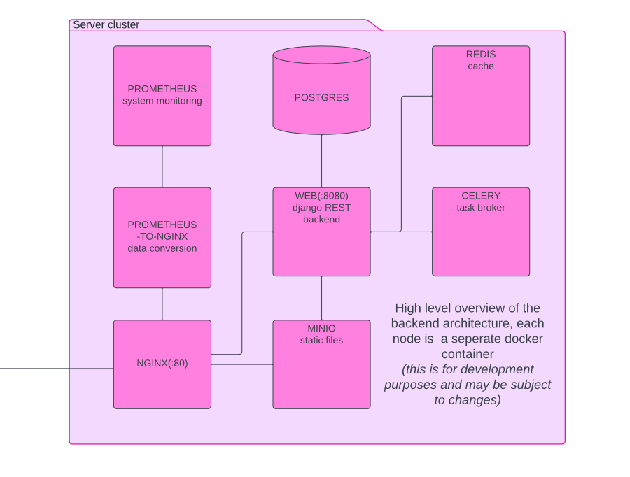
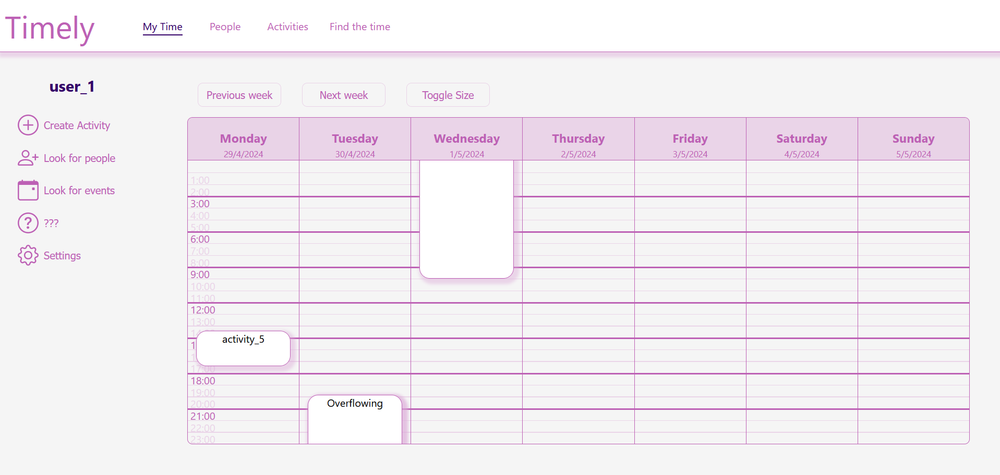

# Timely
Social media platform for time management and event organization

## Premise

The aim of the project is to learn more about RESTful APIs, React and docker. I wanted to focus on the backend architecture and provide it in contenerized form. The server consists of:
- Nginx as load balancer and static file server
- Prometheus and Nginx-to-prometheus converter for basic monitoring
- Postgres database
- Django REST server
- Redis cache
- Celery worker
- MINIO storage

### High level architecture overview

### Screenshots

#### Home Screen

